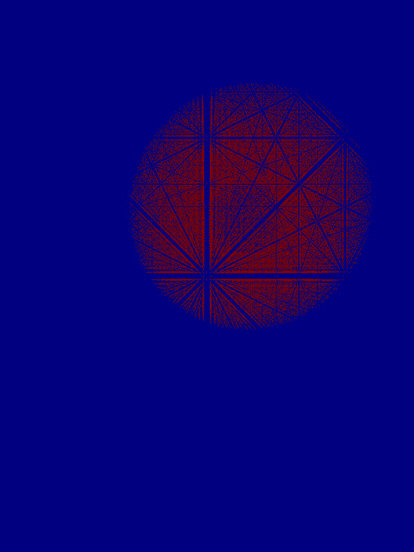

# Collection of visual simulators


Here I am going to drop simulators with visual component. Or, in case of very slow evolution process, with output video in popular formats.

Current status: _in development_.

Dependencies for C++ programs: OpenCV, OpenMP, OpenGL, glm, glwf, glad, boost

## Installation

* OpenCV: `sudo apt-get install libopencv-dev`
* OpenGL: `sudo apt-get install libglu1-mesa-dev freeglut3-dev mesa-common-dev`
* OpenMP: `sudo apt-get install libomp-dev`
* boost: `sudo apt-get install libboost-all-dev`
* glm: `sudo apt-get install libglm-dev libglm-doc`
* glwf: `sudo apt-get install libglfw3-dev libglfw3-doc`
* glad: todo: add script to load glad files to /user/include

## 2d Heat solver

This simulator propagate heat convection as a function of time. By touching canvas, user can add energy to the system in place where was drawed by user. Uses OpenCV for rendering.


### Usage

```console
cd heat2d
make
```

To list available parameters:

```console
./heat_demo -h
Allowed arguments:
  -h [ --help ]                         print this message.
  -y [ --height ] arg (=600)            set height of the window.
  -x [ --width ] arg (=800)             set width of the window
  -a [ --alpha ] arg (=0.05)            alpha parameter of heat equation.
  -i [ --iter ] arg (=20)               number of iterations per render.
  -s [ --size ] arg (=15)               radius of the brush when drawing.
  -t [ --temp ] arg (=1.3)              temperature of the brush.
  -d [ --debug ]                        debug flag to print extra states' info
```

For example:
`./heat_demo -t1 -a1e-4 -s20`

## 3d Heat solver

This is similar to 2d simulator but this one support free camera. Uses OpenGL GLSL with OpenCV to render.



### Usage

```console
cd heat3d
make
```

To list available parameters:

```console
./heat3d_demo -h
Allowed arguments:
  -h [ --help ]                         print this message.
  --dt arg (=0.0001)                    timestep per iteration.
  --dx arg (=0.01)                      space step in Ox, for stability dt <
                                        dr^2.
  --dy arg (=0.01)                      space step in Oy, for stability dt <
                                        dr^2.
  --dz arg (=0.01)                      space step in Oz, for stability dt <
                                        dr^2.
  -a [ --alpha ] arg (=0.005)           thermal diffusivity of the system.
  -d [ --debug ]                        run with debug information.
  -i [ --iter ] arg (=10)               number of iterations per frame.
  --width arg (=800)                    width of the window in startup.
  --height arg (=600)                   height of the window in startup.
  --yaw arg (=-90)                      initial yaw value of the camera.
  --pitch arg (=0)                      initial pitch value of the camera.
  --speed arg (=1.5)                    speed that camera moves in the front
                                        direction.
  --mouse arg (=0.10000000000000001)    mouse sesitivity while zooming.
  --fov arg (=90)                       fov of the camera.
  --video arg (=heat3d_video.avi)       name of recorded video, video is
                                        recorded if debug flag specified.
  --fps arg (=120)                      fps that video is captured.
  --fstate arg (=state.bin)             name of binary file with
                                        (1/dx+1)x(1/dy+1)x(1/dz+1) grid of
                                        float32 initial state.
```